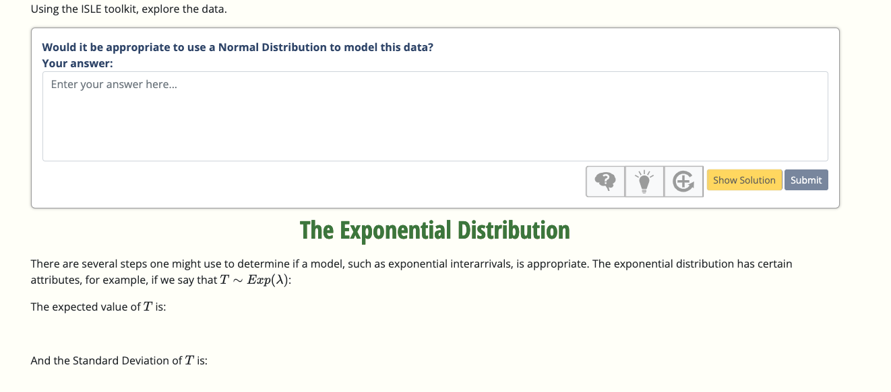

```{r setup, include=FALSE}
knitr::opts_chunk$set(echo = FALSE, warning = F, message = F)
```

```{r package loading, include=FALSE}
library(tidyverse);theme_set(theme_minimal()); theme_update(text = element_text(family = "serif"))
library(ggplot2)
library(MASS)
library(Hmisc)
library(DescTools)
library(goftest)
library(readr)
library("hawkesbow")
library(readr)
library(MASS)
library(lubridate)
library(kableExtra)
```

# Outline

- Background

- Marathon Data

- Simple Model

- Self-Exciting Model

- Model Comparisons (preliminary results)

- Further Research

- SCORE 

# Background

<center>
{width=50%}

</center>

- Are we living in a time of records?
  - Idea:  seems like an increase in records falling, but is it just the nature of randomness?

- How can we address this question?
- What would randomness look like?

# 

::: columns

:::: column

{width=90%}
::::
:::: column
{height=60%}
::::
::: 

# Marathon World Record Data

Men's Marathon world records since 1908

```{r}
record_table_mod<-read_rds("record_table_mod.rds")
days_between = as.numeric(diff(record_table_mod$Date_ymd))
daysfromstart <- cumsum(days_between)
daysfromstart <- c(0,daysfromstart)  ### get data in terms of days from first record (time 0)
  # units of year
daysfromstart_mod2 <- daysfromstart/365 
days_between_mod2 = diff(daysfromstart_mod2)

```

- 50 total

- First 5

`r knitr::kable(record_table_mod[1:5,1:5]) %>%
  kable_styling(font_size = 7)`
  
- Last 5

`r knitr::kable(record_table_mod[46:50,1:5]) %>%
  kable_styling(font_size = 7)`

# Fun Facts

::: columns

:::: column

- Countries with most records
  - U.K.  12
  - U.S.   7
  - Japan/Kenya/Ethiopia  5
  
- Largest decrease:  
  - James Clark, US, 1909
  - 2:46:52.8 
  - Nearly 6 minutes faster than previous

:::: 

:::: column

{height=50%}
::::

::: 


# Fun Facts

::: columns

:::: column

{height=50%}

::::


:::: column
- Most records
  - Jim Peters, UK, 
  - Set records 4 times from 1952-1954

- Locations with most records
  - Polytechnic Marathon (London) - 8
  - Berlin Marathon - 8 
    - Last 7 records
  - Tokyo Marathon - 5
  
::::

:::
# Visualizing the data

- Two and three hour times shown as horizontal lines
```{r, fig.align='center', out.width="75%"}
td<-seconds_to_period(c(7500,8500,9500,10500))
timelabs <- sprintf('%02d:%02d:%02d', td@hour, minute(td), 
                                   round(second(td)))
p1<-plot(record_table_mod$Date_ymd, record_table_mod$Time_t, 
         type = "h", xlab = "Data (YMD)", ylab = "Record (H:M:S)", 
         yaxt = "n", ylim = c(7100,10800), lwd = 2)
axis(2, at = c(7500,8500,9500,10500), labels = timelabs, 
     cex.axis = 0.75)
abline(a = 7200, b = 0, lty = 2, col = "red", lwd = 3)
abline(a = 3*60*60, b = 0, lty = 2, col = "red", lwd = 3 )
```
- 2 hour marathon pace: 4:35 per mile

- 3 hour pace:  6:52 per mile


# SIMPLE MODEL

## POISSON PROCESS 

A model for a series of discrete events where the average time between events is known, but the exact timing of events is "random" meeting the following criteria: 

-  Events are independent of each other. The occurrence of one event does not affect the probability another event will occur.

-  The average rate (events per time period) is constant.

-  Two events cannot occur at the same time.

# Poisson Process Interarrival Times

The time between events (known as the interarrival times) follow an exponential distribution defined as:

$$P(T>t) = e^{-\lambda t}$$

- T is the random variable of the time until the next event

- t is a specific time for the next event

- $\lambda$ is the rate:  the average number of events per unit of time.  

Note the possible values of T are greater than 0 (positive only).  


# Reasonableness of Exponential Interarrivals

The exponential distribution has certain attributes, for example:

\begin{center}
$E(T) = SD(T) = 1/\lambda$
\end{center}

\vspace{12pt}

For the time between record data:

- Mean: `r round(mean(days_between_mod2),2)` years

- SD: `r round(sd(days_between_mod2),2)` years

Reasonable...slightly "overdispersed"


#  Estimating the Model

We estimate (MLE) 
$\lambda = 1/E(T)$ = `r round(fitdistr(days_between_mod2,"exponential")$estimate,3)`


```{r, fig.align='center', out.width="75%"}
expfit=fitdistr(days_between_mod2,"exponential")
exprate<-expfit$estimate

x=density(days_between_mod2)
hist(days_between_mod2,main="Histogram, density curve and exponential model",xlab="Interarrival Time",freq=FALSE,ylim=c(0,0.5))
lines(x,col="red",lty = 2, lwd = 3)
curve(dexp(x, rate = exprate),col="blue", lty = 1, lwd = 3, add = TRUE)

```


# Graphical Assessment of Fit

Empirical Distribution Function (EDF) and Cumulative Distribution Function (CDF)

```{r, fig.align='center', out.width="75%"}
x=seq(0,max(days_between_mod2),0.1)
plot(x,pexp(x,rate=exprate),type="l",col="red",lwd=3,lty=2, main="EDF and Exponential CDF",xlab="Interarrival Time",ylab="Proportion <= x")
Ecdf(days_between_mod2,xlab='Interarrival Times',subtitle=FALSE,add=TRUE,lwd=2)
```

# Testing Model Fit 

## Goodness of fit tests
\vspace{12pt}
- Kolmogorov-Smirnov:  p = `r round(ks.test(days_between_mod2,pexp,rate=exprate)$p.value,3)`

- Cramer-Von Mises:  p = `r round(cvm.test(days_between_mod2,pexp,rate=exprate)$p.value,3)`

- Anderson-Darling:  p = `r round(ad.test(days_between_mod2,pexp,rate=exprate)$p.value,3)`

\vspace{12pt}
All fail to reject the null hypothesis of model fit

# Are records then random?

```{r, fig.align='center', out.width="75%"}

PlotQQ(days_between_mod2, function(p) qexp(p, rate=exprate), col="red", pch = 16, cex = 1.5,
       main = "QQ Plot of Exponential Model")

```

# What are the poorly fit points?

- 11.5 year gap

`r knitr::kable(record_table_mod[16:17,1:5]) %>%
  kable_styling(font_size = 7)`


- 10.4 year gap

`r knitr::kable(record_table_mod[40:41,1:5]) %>%
  kable_styling(font_size = 7)`

# Have we answered the question?

- Model fit seems to suggest random events (no "golden age" of records)

- Assumptions such as independence very hard to assess

  - Could model miss periods of increased records and still look reasonable?
  
  - There may be factors that increase the probability of records...

# A "Self-Exciting" Model

## Self-Exciting Point Processes

- Events "trigger" more events

- Examples of use include earthquakes, crime waves

## Hawkes Processes

- Let $H_t$ be the history of events up to time $t$.  The Hawkes (1971) model of the conditional intensity is:

$$\lambda(t|H_t) = \nu + \sum_{i:t_i<t} g(t - t_i)$$
where $\nu$ is the background rate of events and g is the "triggering function".

# Exponential Triggering Function

- The "triggering" function can be further decomposed:

$$g = \mu g^*$$
where $g^*$ is a density function known as the "reproduction kernel" and $\mu$ is known as the "reproduction" mean.  

- A common choice for the "reproduction kernel" is the exponential density given by:

$$g^*(t) = \beta e^{-\beta t} $$

# Fitting the model


```{r}
set.seed(1234)
optMarathon<-mle(daysfromstart_mod2,"Exponential",110.23)  # end date picked number greater than longest times
nu = optMarathon$par[1]
mu = optMarathon$par[2]
b = optMarathon$par[3]

```

Parameter estimates for marathon data (exponential) Hawkes process, using MLE (Cheyson and Lang, 2020): 

- baseline intensity  `r round(nu,3)`
- reproduction mean  `r round(mu,3)`
- exponential reproduction function rate `r round(b,3)`

Note the baseline intensity is slightly lower than the constant model rate estimate of `r round(exprate,3)`

The estimated reproduction function is then: 

$$g(t) = \mu g^*(t) = \mu \beta e^{-\beta t} $$
$$ = `r round(mu,2)` * `r round(b,2)` e^{-`r round(b,2)` t} $$

# Model implications

```{r}
rate0=mu*b
```


At the instant of the first event (world record), $t = t_1$ so $g(t - t_1 = 0)$ and the reproduction rate is:

$$g(0) = `r round(mu,2)` * `r round(b,2)` e^{-`r round(b,2)` * 0} = `r round(mu,2)` * `r round(b,2)` =  `r round(rate0,3)` $$

- The rate increases from the baseline rate of `r round(nu,3)` by this amount at the moment of this occurrence

- The rate then decays back to baseline over time (unless a new event occurs)

- Each new event "excites" the rate to increase and then decay

# The Intensity Function over Time

- The intensity function gives the value of the rate at any time

- Here we simulate 100 years based on the fitted model.

  - The rate is at the baseline of `r round(nu,3)` until a new event occurs

  - We see the jump in rate with each new event

  - The rate decays to baseline unless another event happens


```{r, fig.align='center', out.width="75%"}
set.seed(777)
simRecs_Hawkes <- hawkes(100, fun = optMarathon$par[1], repr = optMarathon$par[2], family = "exp", rate = optMarathon$par[3]) 

plot(simRecs_Hawkes, intensity = TRUE, xlab = "Time (Years)")

```

# How Fast is the rate "decay"

- Within 1 year essentially return to baseline

```{r, fig.align='center', out.width="75%"}

t1 <- seq(0,1,0.01)
plot(t1, mu*b*exp(-b*t1), xlab = "Time Since Event (Years)", 
     ylab = "Increase in Intensity above Baseline")

```


# Process as "Generations"

- An event (1st generation) may spur immediate new event (2nd generation)...etc

- Cannot truly identify in our data; below is simulated

```{r, fig.align='center', out.width="75%"}
plot(simRecs_Hawkes, intensity = FALSE)
```

# Would a Poisson Process model detect "excited" process?

- Simulated Hawkes process using estimates from our data
  - 1000 runs of 100 years each 
- Fit exponential (constant) rate interrarival model
  - Tested fit using K-S Test

```{r, fig.align='center', out.width="60%"}


holdp <- rep(0,1000)
for(i in 1:1000){
  simRecs_Hawkes <- hawkes(100, fun = optMarathon$par[1], repr = optMarathon$par[2], family = "exp", rate = optMarathon$par[3]) 
  days_between_sim = as.numeric(diff(simRecs_Hawkes$p))
  expfitHawkesSim <- fitdistr(days_between_sim,"exponential")
  exprateHawkesSim <-expfitHawkesSim$estimate
  holdp[i]<-ks.test(days_between_sim,pexp,rate=exprateHawkesSim)$p
}
hist(holdp, main = "K-S Test p-values, 1000 simulations", xlab = "p-value" )
abline(v=0.05, col="red",lty=2,lwd =3)


```

- Rejected fit in only `r 100*sum(holdp < 0.05)/1000` percent of simulations.

# Inference for parameter estimates

- Ogata (1978) asymptotic result for the parameters ($\theta$):

$$M^{1/2}(\hat{\theta}_M - \theta_o) \xrightarrow{d} N(0, I(\theta_o)^{-1})$$
where $M$ is the total time for the process and:


$$-M^{-1}H_M(\theta_o) \xrightarrow{p} I(\theta_o)$$

- We can estimate the Hessian, $H_M$, from ML estimation
  - Use the result to produce confidence intervals for the parameters.
  - Asymptotic result may not hold (Cavaliere et al, 2021)

# Estimated Ogata confidence intervals

95% confidence intervals based on Ogata for the three model parameters

```{r}
#optMarathon$model$ddloglik(daysfromstart_mod2, optMarathon$end)
hessian<-optMarathon$model$ddloglik(daysfromstart_mod2, optMarathon$end)
infomat<- -1*hessian/optMarathon$end
varcov<-solve(infomat)
#varcov
se1<-sqrt(varcov[1,1])/sqrt(optMarathon$end)
se2<-sqrt(varcov[2,2])/sqrt(optMarathon$end)
se3<-sqrt(varcov[3,3])/sqrt(optMarathon$end)
nu.ll<-round(nu,3)-qnorm(0.975)*se1
nu.ul<-round(nu,3)+qnorm(0.975)*se1
mu.ll<-round(mu,3)-qnorm(0.975)*se2
mu.ul<-round(mu,3)+qnorm(0.975)*se2
b.ll<-round(b,3)-qnorm(0.975)*se3
b.ul<-round(b,3)+qnorm(0.975)*se3
```

- Baseline intensity estimate:  `r round(nu,3)`
  - 95% CI:  `r round(nu.ll,3)`, `r round(nu.ul,3)`
   
- Reproduction mean estimate: `r round(mu,3)`
  - 95% CI:  `r round(mu.ll,3)`, `r round(mu.ul,3)`
  
- Exponential reproduction function rate estimate: `r round(b,3)`
  - 95% CI:  `r round(b.ll,3)`, `r round(b.ul,3)`

# Intensity Functions for Both Models 

- The Hawkes intensity function is the model applied to the actual data

- The function for the Poisson model is a constant rate of `r round(exprate,3)`

```{r, fig.align='center', out.width="75%"}

base_x<-seq(0,114,.01)
base_y<-rep(nu,length(base_x))
 
base_y_exc <- mu*b*exp(-b*base_x)+base_y
 
excite <- base_y
for(j in 1:length(daysfromstart_mod2)){
  for(i in 1:length(base_x)){
    if(daysfromstart_mod2[j]>base_x[i]){
      excite[i] <- excite[i]+0
    }else{
      excite[i] <- excite[i]+mu*b*exp(-b*(base_x[i]-daysfromstart_mod2[j]))
    }
  }
}
 
plot(base_x,excite,type="l",ylim=c(0,2),col="red", lwd = 2.5,
     xlab = "Time (years since 1908)", ylab = "Conditional Intensity")
points(daysfromstart_mod2,rep(0,length(daysfromstart_mod2)), pch=3)

abline(a = exprate, b = 0, lty = 2, col = "blue", lwd = 3)

```


# The Compensator Function

- Integrated intensity function...cumulative rate

- Simple example:  constant intensity with rate 2 per year

- Compensator grows at constant rate (linear)

```{r, figures-side, fig.show="hold", out.width="40%"}

par(mar = c(4, 4, .1, .1))
plot(c(0,1,2),c(2,2,2), type = "l", xlab = "Time (Years)", 
     ylab = "Conditional Intensity")

plot(c(0,1,2),c(0,2,4), type = "l", xlab = "Time (Years)", 
     ylab = "Compensator Function")

```

# Arrivals Exactly on Schedule

- Two arrivals per year spaced perfectly at 6 months

- Values of compensator for points 1, 2, 3, 4 are 1, 2, 3, 4

- Compensator values at arrivals are "residuals" (Paparoditis, 2000)

  - if "on schedule" Poisson process with rate 1

```{r, fig.align='center', out.width="80%"}

plot(c(0,1,2),c(0,2,4), type = "l", xlab = "Time (Years)", 
     ylab = "Compensator Function")
points(c(0.5,1,1.5,2),c(1,2,3,4), cex = 3, pch = 4, col = "red")

```

# "Residuals" based on Compensator

- Suppose actual arrivals still constant but 3 per year (model is 2 per year)

- Residuals below the y = x (Poisson rate 1) line

```{r, fig.show="hold", out.width="40%"}

plot(c(0,1,2),c(0,2,4), type = "l", xlab = "Time (Years)", 
     ylab = "Compensator Function")
points(c(0.33,0.67,1,1.33,1.67,2),2*c(0.33,0.67,1,1.33,1.67,2),
       cex = 3, pch = 4, col = "red" )

plot(c(0:6),c(0:6), type = "l", xlab = "Event Number", 
     ylab = "Residuals")
points(c(1:6),2*c(0.33,0.67,1,1.33,1.67,2),
       cex = 3, pch = 4, col = "red" )

```

# Compensator Function for Fitted Hawkes Model

```{r, fig.align='center', out.width="75%"}
compensate<-compensator(daysfromstart_mod2, t=0:111, fun = optMarathon$par[1], 
                        repr = optMarathon$par[2], family = "exp", rate = optMarathon$par[3])
plot(c(0:111),compensate, type = "l", xlab = "Time (Years since 1908)",
     ylab = "Compensator")
points(daysfromstart_mod2,rep(0,length(daysfromstart_mod2)), pch=3)
```


# "Self Exciting" Portion of Compensator Function 

- We remove the baseline (cumulative) rate to better see the Hawkes process

```{r, fig.align='center', out.width="75%"}

compensate<-compensator(daysfromstart_mod2, t=0:111, fun = optMarathon$par[1], 
                        repr = optMarathon$par[2], family = "exp", rate = optMarathon$par[3])
plot(c(0:111),compensate-optMarathon$par[1]*seq(0,111), type = "l", 
     xlab = "Time (Years since 1908)", ylab = "Self-excite Portion of Compensator")
points(daysfromstart_mod2,rep(0,length(daysfromstart_mod2)), pch=3)

```

# Residuals for Fitted Hawkes Model

-  Arrivals at times "faster" than model

- Jump up event 17:  1947 record (after 12 year gap)

- Jump up event 41:  1998 record (after 10 year gap)

```{r, fig.align='center', out.width="75%"}
resid<-residuals(daysfromstart_mod2, fun = optMarathon$par[1], repr = optMarathon$par[2], 
                  family = "exp", rate = optMarathon$par[3],
                 xlab = "Event Number", ylab = "Residuals")
plot(resid, col = "red", cex = 1.5, pch = 16)
abline(0, 1, col="blue", lty="dashed", lwd = 2)

```


# Constant Rate Model Compensator and Residuals

```{r, fig.show="hold", out.width="40%"}

compensate_const<-compensator(daysfromstart_mod2, t=0:111, fun = exprate, repr = 0, 
                        family = "exp", rate = 0)
plot(c(0:111),compensate_const, type = "l",
     xlab = "Time (Years since 1908)", ylab = "Compensator")
resid_const<-residuals(daysfromstart_mod2, fun = exprate, repr = 0, 
                 family = "exp", rate = 0)
plot(resid_const, xlab = "Event Number", ylab = "Residuals", cex = 1.5)
abline(0, 1, col="blue", lty="dashed", lwd = 2)


```

# Comparing Model Residuals

- Hawkes generally "better" 

- Two large gaps clear impact on both models

- Hard to tell degree of improvement

```{r, fig.align='center', out.width="80%"}
plot(resid_const, xlab = "Event Number", ylab = "Residuals", col = "black", pch = 4, cex = 1.5)
abline(0, 1, col="blue", lty="dashed", lwd = 2)
points(resid, col ="red", pch = 16)
legend(1, 45, legend=c("Constant Rate", "Hawkes"),
       col=c("black", "red"), pch=c(4,16))

```


# Comparing Models - Overdispersion

::: columns

:::: column

{width=100%}

::::

:::: column

{width=100%}

::::

:::


# Conclusions

- Men's marathon records reasonably modeled using Poisson process

- Some indication a "self-exciting" process could explain arrivals better

- Other factors not in model

  - As times get faster harder to break the record? 

  - Two "outlier" periods impact the models
  
  - New technology ("super shoes"), training methods etc.
  
  - Magnitude of event: how much faster than previous (inverse?)


# Further Work

- Explore models for other events: women's marathon, other distances, swimming

- Develop better metrics to compare and assess models


# SCORE

- NSF Grant, 2022 - 2025

- SCORE with Data: Building a sustainable national network for developing and disseminating
**\textcolor{blue}{S}**ports **\textcolor{blue}{C}**ontent for **\textcolor{blue}{O}**utreach, **\textcolor{blue}{R}**esearch, and **\textcolor{blue}{E}**ducation in data science

- Carnegie Mellon, Baylor, West Point, University of Pittsburgh, St. Lawrence University, Yale

- Partners across sports industry

  - NBA, NFL, MLB, NHL teams
  
  - ESPN
  
  - Other sports related organizations (analytics, etc)

# SCORE Goals

- Create a national network 
  - academic, industry, media and government partners 
  - elevating data science education
  - particularly in underrepresented populations and minorities

- Modules based on sports
  - Develop, implement, evaluate and disseminate an educational framework 
  - Case-based Learning involving real-world problems and applications

- Educational research on data science education delivery modalities


# SCORE Module

https://isle.stat.cmu.edu/SCORE/marathons/


\setbeamerfont{caption}{size=\scriptsize}


::: columns

:::: column

{width=60%}

{width=80%}
::::
:::: column
{height=60%}

{height=60%}

::::
::: 

# SCORE Participation

- Participate as part of network

- Use and test modules

- Create new modules 
  - Example modules soon available
  - "HandbooK" with criteria in development
  - Peer-review similar to R package contribution

Contact us at:

Rod:  Rodney_Sturdivant@baylor.edu

Nick:  nicholas.clark@westpoint.edu

# Notes 

\footnotesize

- Data sources: 

Wikipedia scraped August 12, 2022 (https://en.wikipedia.org/wiki/Marathon_world_record_progression) 

- Poisson process:

https://towardsdatascience.com/the-poisson-distribution-and-poisson-process-explained-4e2cb17d459

- Hawkesbow, R Package for Hawkes process:

Felix Cheysson (2021). hawkesbow: Estimation of Hawkes Processes from Binned Observations.  R package version 1.0.2. https://CRAN.R-project.org/package=hawkesbow

# References

\footnotesize

Cavaliere, G., Lu, Y., Rahbek, A., and Østergaard, Jacob (2021). Bootstrap inference for Hawkes and general point processes.  Discussion Paper Series, U. Copenhagen Economics. http://dx.doi.org/10.2139/ssrn.3844552

Cheysson, F., and Lang, G. (2020). Strong mixing condition for Hawkes processes and application to Whittle estimation from count data. arXiv, March. https://arxiv.org/abs/2003.04314.

Hawkes, Alan G. (1971). Spectra of Some Self-Exciting and Mutually Exciting Point Processes. Biometrika 58 (1): 83–90. https://doi.org/10.2307/2334319.

Ogata, Y. (1978). The asymptotic behavior of maximum likelihood estimators for stationary point processes. Annals of the Institute of Statistical Mathematics, 30(2), 243-261.

Paparoditis, E. (2000). Spectral density based goodness-of-fit tests for time series models. Scand. J. Stat. 27 (1): 143–176. https://doi.org/10.1111/1467-9469.00184.


